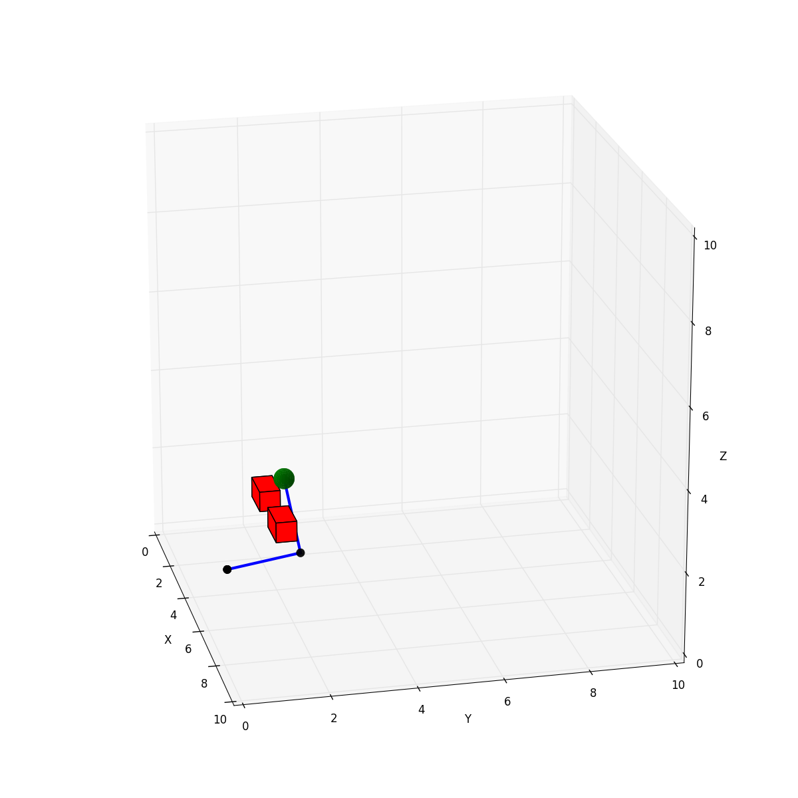
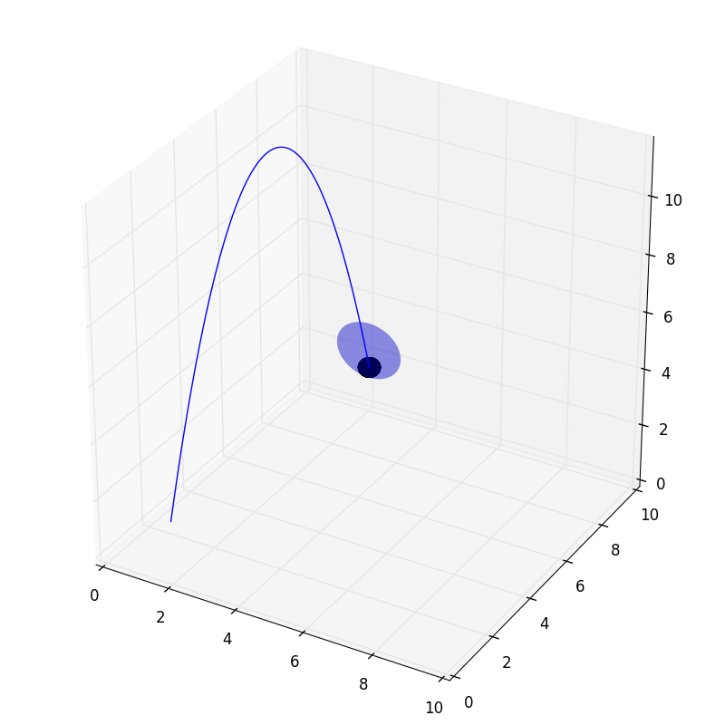
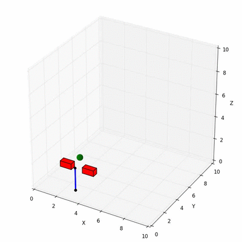

# Maddux
### Robot Arm and Simulation Environment

[You can view the complete documentation here.](http://bencaine.me/maddux/)

Created to use in a project for [Robert Platt's Robotics Course](http://www.ccs.neu.edu/home/rplatt/cs5335_2016/index.html)

#####  Features
- Arbitrary Length Arms
- Forward Kinematics
- Inverse Kinematics
- Simulation Environment (with objects like Balls, Targets, Obstacles)
- 3D Environment Animations
- 3D Arm Animations
- End Effector Position, Velocity


### Arm Visualization and Animations
```python
import numpy as np
from maddux.objects import Obstacle, Ball
from maddux.environment import Environment
from maddux.robots import simple_human_arm

obstacles = [Obstacle([1, 2, 1], [2, 2.5, 1.5]),
             Obstacle([3, 2, 1], [4, 2.5, 1.5])]
ball = Ball([2.5, 2.5, 2.0], 0.25)

q0 = np.array([0, 0, 0, np.pi / 2, 0, 0, 0])
human_arm = simple_human_arm(2.0, 2.0, q0, np.array([3.0, 1.0, 0.0]))

env = Environment(dimensions=[10.0, 10.0, 20.0],
                  dynamic_objects=[ball],
                  static_objects=obstacles,
                  robot=human_arm)

q_new = human_arm.ikine(ball.position)
human_arm.update_angles(q_new)
env.plot()
```




### Environment Visualizations and Animations

```python
from maddux.environment import Environment
from maddux.objects import Ball, Target

ball = Ball([2, 0, 2], 0.25)
target = Target([2, 10, 2], 0.5)
environment = Environment(dynamic_objects=[ball], static_objects=[target])

release_velocity = np.array([0, 15, 5])
ball.throw(release_velocity)

# Either run environment for n seconds
environment.run(2.0)
# And plot the result
environment.plot()

# Or, you can animate it while running
environment.animate(2.0)
```



### Arm Usage
```python
from maddux.robots.link import Link
from maddux.robots.arm import Arm

# Create a series of links (each link has one joint)
L1 = Link(0,0,0,1.571)
L2 = Link(0,0,0,-1.571)
L3 = Link(0,0.4318,0,-1.571)
L4 = Link(0,0,0,1.571)
L5 = Link(0,0.4318,0,1.571)
links = np.array([L1, L2, L3, L4, L5])

# Initial arm angle
q0 = np.array([0, 0, 0, np.pi/2, 0])

# Create arm
r = Arm(links, q0, '1-link')
```

### Use with Deep Q Learning
This library was created with the intent of experimenting with reinforcement learning on robot manipulators. [nivwusquorum/tensorflow-deepq](https://github.com/nivwusquorum/tensorflow-deepq) provides an excellent tool to experiment with Deep Q Learning.

[maddux/rl_experiments/](./experiments/reinforcement_learning/) provides full reinforcement learning classes and arm environments for doing obstacle avoidance and manipulator control using the above Deep Q Learning framework.

For fun, here's some examples

##### Iteration 0



##### Iteration 100


##### Iteration 1000


